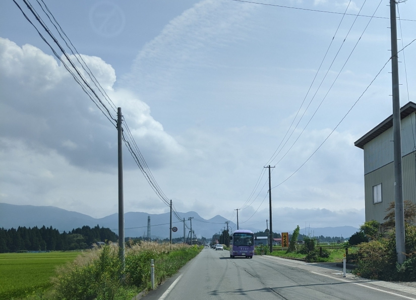
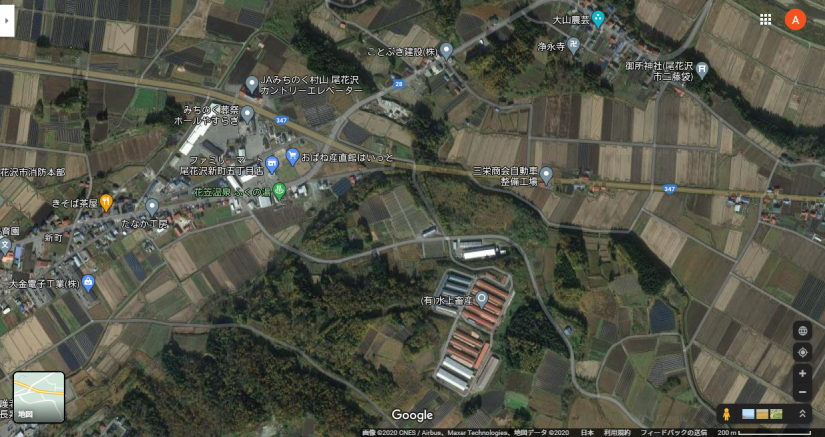
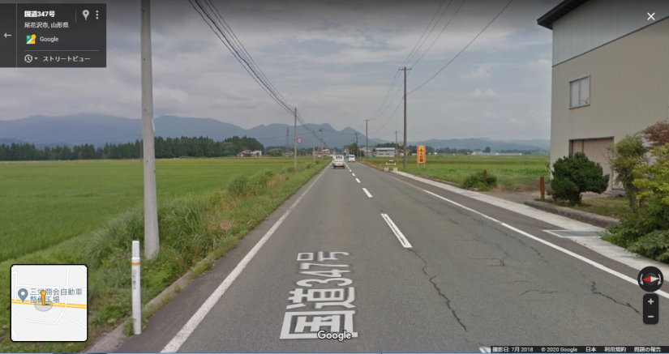
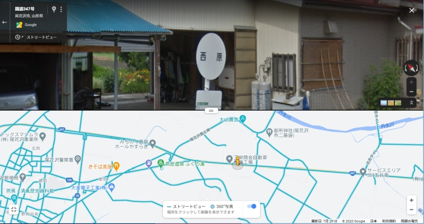
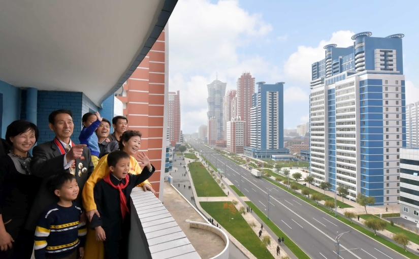
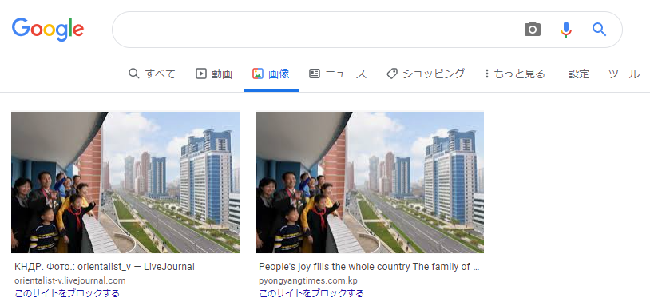
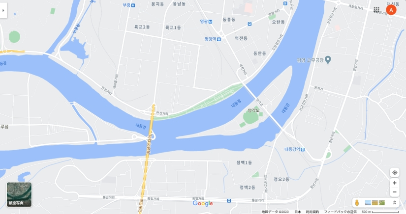
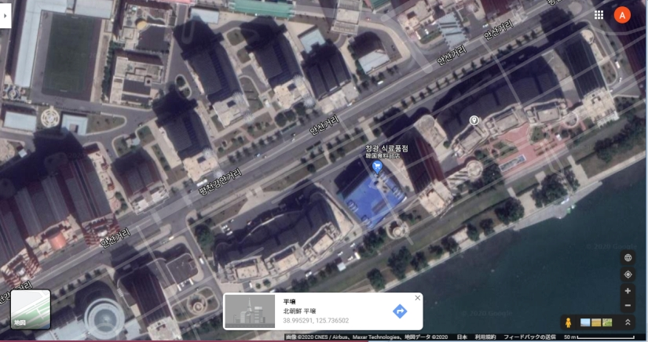
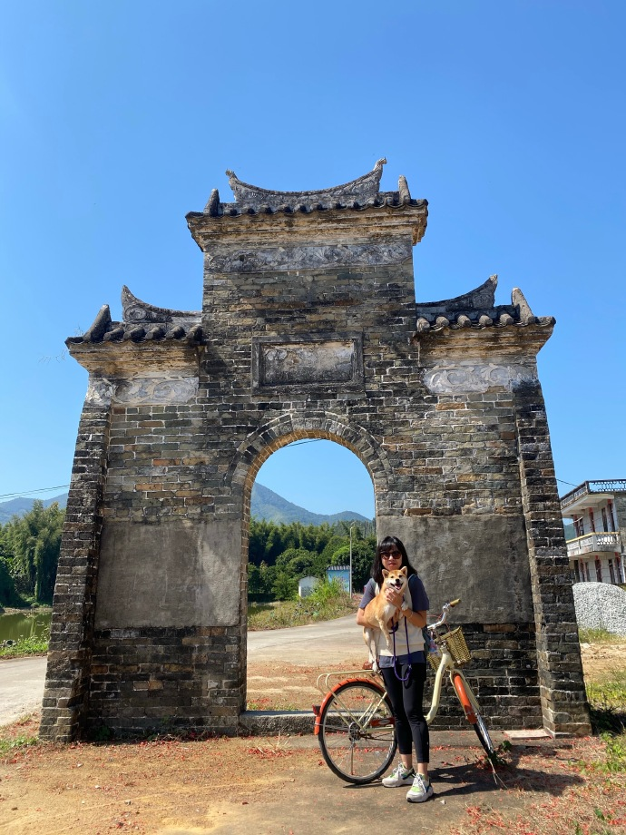

# AVTOKYO2020 Open xINT CTF 2020 write-up

## [Bus] Easy Bus
AVTOKYO恒例「バス問」。これは2問中の易しい方。

設問は、写真が撮られた位置の近くのバス停を探せ。

与えられた画像の左側に「山形県」の白いポール、右側に「ふくの湯」の看板。  
「山形県　ふくの湯」でGoogleマップ検索する。  

「花笠温泉　ふくの湯」の存在が確認できる。  
元画像が直線道路なことを確認し、すぐ上の国道347号線でストリートビューを表示。  

白いポールと看板、特徴的な山の形が一致する場所を発見。  
道路を行ったり来たりしてバス停を探す。

バス停「西原」を発見。読みは「にしはら」の模様。

## [MAP] CG
設問は、写真が撮られた位置の座標を示せ。

取り合えず、Google画像検索で検索する。

このピンクと水色の特徴的なタワマン群は北朝鮮の「未来科学者通り」らしい。

この通りを紹介しているサイトなどからおよその場所が分かったのでGoogleマップで検索する。

三日月上の中州の北側に位置する緑色の一帯が「未来科学者通り」の模様。  

拡大して航空写真に切り替える。なお、ストリートビューは無い。

道路の向かい側を見ると、屋上に丸い物体が付いたタワマンがあることや、  
すぐ奥に近接してピンクのタワマンがあることからどの建物かあたりが付く。  

写真ではベランダが道路に対して斜めになっているので、それらしき位置にピンを立て、  
座標の小数3桁まで「N38.995 E125.736」を回答すれば正解。

## [MAP] GATE
設問は、写真の門の座標を示せ。

この問題は、門の特定はできて、座標も分かったつもりだった。が、正解にならず悔しい。

定番のGoogleやYANDEXの画像検索では該当する門が見つからない。  
百度の画像検索を使えば、割とすぐに特定が可能。

最初に下記ページにアクセス。ページ中ほどに、同じ門がばっちり写っている。  
https://www.meipian.cn/2hssgqz4

中国語はさっぱり読めないが、石碑によると「上围牌坊」というらしい。  
この名前で検索すると、下記の観光紹介サイトに到達。写真も名前も間違いない。  
http://www.bytravel.cn/Landscape/86/shangweipaifang.html

> 上围牌坊位于惠州市龙门县地派镇渡头村，GPS地理坐标为北纬23°46′29.0″，东经114°09′55.8″，海拔103米。

位置情報までばっちり書かれていたが、これでは正解にならなかった。無念。
